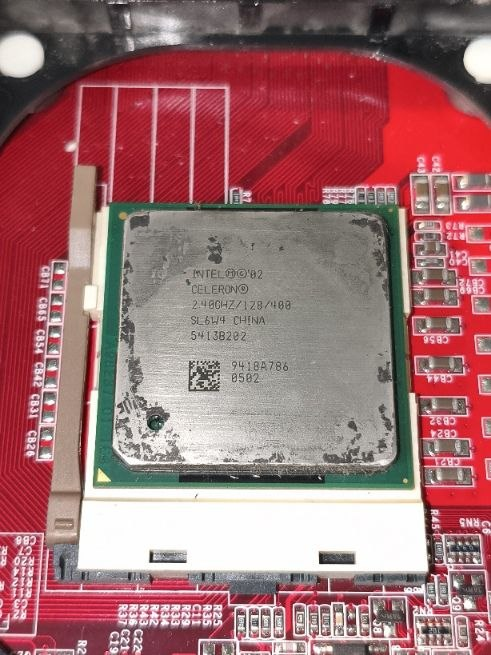
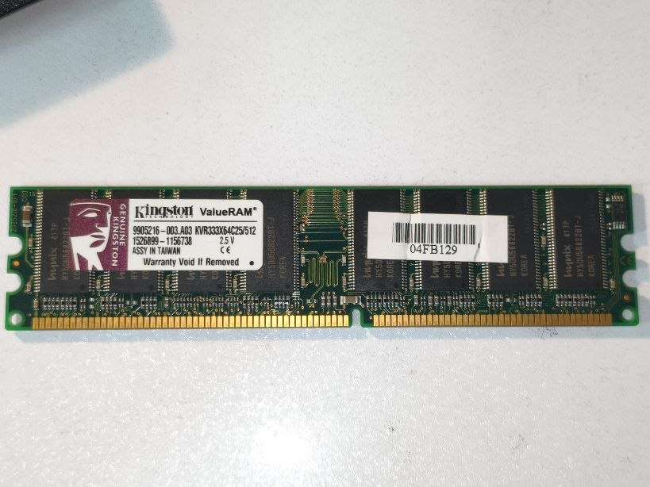
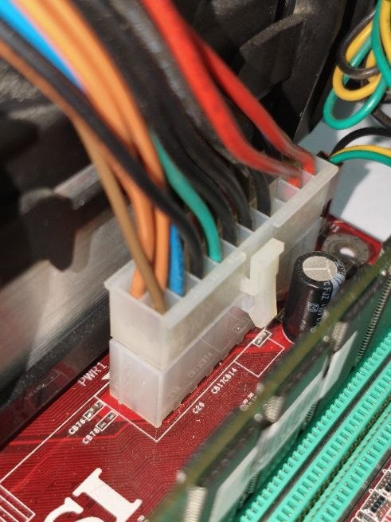
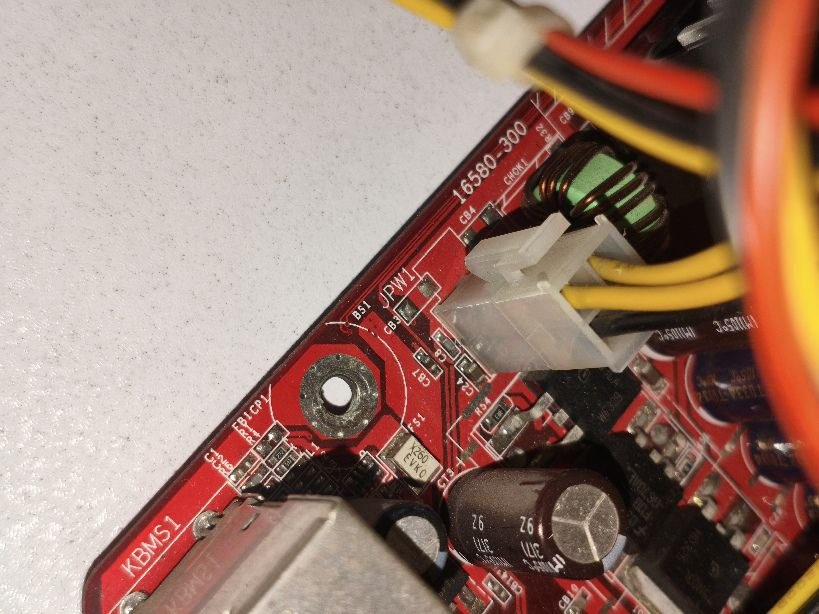
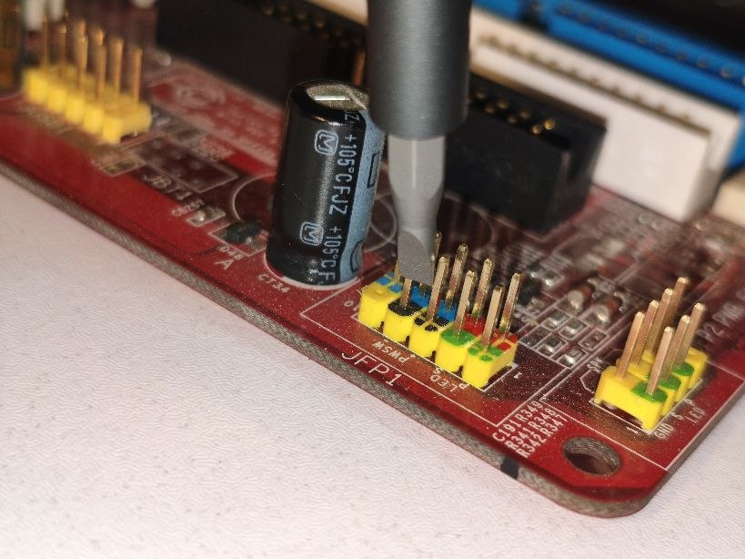
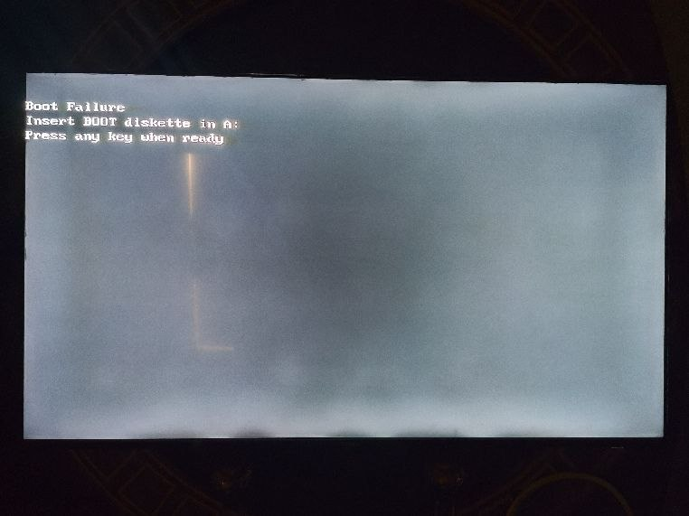
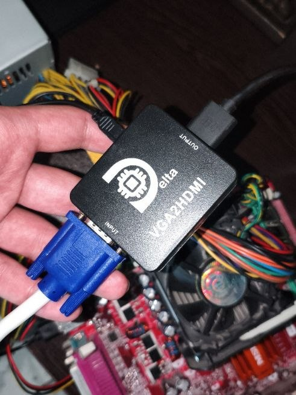

+++
title = "making a crappy theft-detector via an old motherbord"
date = "2026-06-05T18:00:00+03:30"
dateFormat = "06-01-02" # per-post date formatting‍
author = "yusef"
authorTwitter = "" # do not include @
cover = "cover.jpg"
tags = ["hardware", "linux", "motherboard"]
description = "cheapest theft-detector ever using a 2004 motherboard + a webcam"
showFullContent = false
readingTime = true
hideComments = false
draft = true
+++

nephew story

cpu: intel-celeron 2.40ghz/128/400 + new arctic mx-4 thermal-paste (for chipset as well)

ram: kingston 512mb

power: 220v ac to 300w pc cable
main 20pin + cpu 4pin

turning it on via short-circuting pwsw in jfp1

making sure it boots even without an os

using a vga cable + vga to hdmi

install linux on a 32gb micro sd-card as the main storage using a caed reader