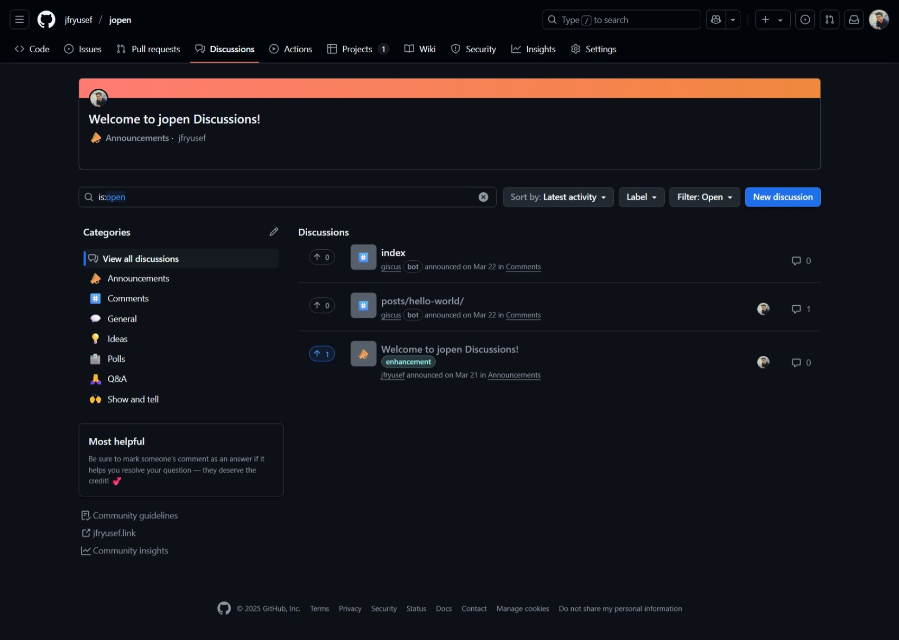
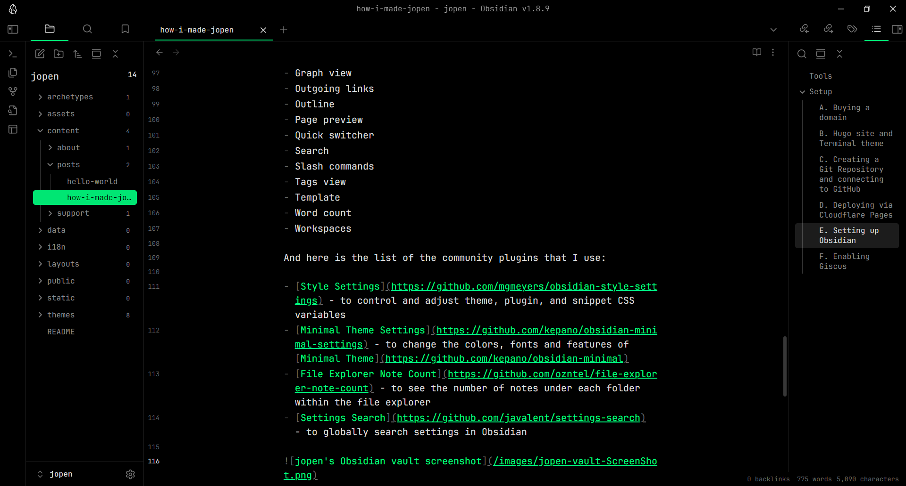

+++
title = "How I Made jopen?"
date = "2025-07-06T13:41:37+03:30"
lastmod = "2025-11-01"
#dateFormat = "2006-01-02" # This value can be configured for per-post date formatting‍
author = "yusef"
authorTwitter = "" #do not include @
cover = ""
tags = ["jopen", "Markdown", "Obsidian", "Git", "GitHub", "Hugo", "Website", "Software"]
description = "How I built a blog using just Markdown and Git"
showFullContent = false
readingTime = true
hideComments = false
draft = false
+++

jopen is a blog about mostly tech-related projects I do for fun. In fact, jopen itself is one of them! I wanted to take notes on the process of my projects, and there was no reason to keep them private. So, I made this blog, *To Learn In Public*.

I don't like bloated CMSs. This stack is cheap, open-source, and lets me focus on writing in a tool I already use (Obsidian). Plus, it’s all plain text — future-proof.

Here's how I made it:

---

## Tools

- [Obsidian](https://obsidian.md/) for writing posts & local Markdown management
- [GitHub](https://github.com/) for cloud-based version control + repo hosting
- [Hugo](https://gohugo.io/) (with [Terminal](https://github.com/panr/hugo-theme-terminal/) theme) as the static site generator
- [Cloudflare Pages](https://pages.cloudflare.com/) for free, automated deployment
- [Giscus](https://giscus.app/) to integrate a comment system via [GitHub Discussions](https://github.com/features/discussions)

Every push to GitHub updates the blog via Cloudflare and every comment shows up on GitHub as well.

## Setup

#### A. Buying a domain

This was the only step in which I paid for something, purchasing this `.link` domain for ~$10 a year. But there were cheaper (even free) options as well.

#### B. Hugo site and Terminal theme 

I customized the color scheme using the [Terminal CSS customizer](https://panr.github.io/terminal-css/) and chose `#282828` as the background, `#ebdbb2` as the foreground, and `#689d6a` as the accent color. This generated a `.css` file, a **favicon**, and an **OG image** that I added to my site.

And here's the list of changes I made to the `/themes/terminal/config.toml` file:

```toml
[params]
customCSS = ["css/terminal.css"]
centerTheme = true
showLastUpdated = true
updatedDatePrefix = "Updated on"
readMore = "Read"
missingContentMessage = "This is not the webpage you're looking for." # A reference from the movie Star Wars: Episode IV - A New Hope
minuteReadingTime = "min[s] read"
words = "word[s]"

[params.logo]
logoText = "jopen"

[menu]

[[menu.main]]
identifier = "about"
name = "About"
url = "/about"

[[menu.main]]
identifier = "tags"
name = "Tags"
url = "/tags"

[[menu.main]]
identifier = "search"
name = "Search"
url = "https://www.google.com/search?q=site%3Ajfryusef.link+QUERY"
```

#### C. Creating a Git Repository and connecting to GitHub

I initialized the local Hugo files in [Git](https://git-scm.com/) and turned on Discussions as a feature on jopen's GitHub repo (so I can use Giscus in step F).



#### D. Deploying via Cloudflare Pages

Added `jfryusef.link` and `www.jfryusef.link` as two custom domains.

#### E. Setting up Obsidian

I merged the Obsidian vault root and local files of Hugo, and every once in a while, I push its content to GitHub to sync manually because I couldn't make the [Git plugin](https://github.com/Vinzent03/obsidian-git) to work properly.

Here is the list of all the core plugins that are enabled in my vault:

- Backlinks
- Bookmarks
- Command palette
- File recovery
- Files
- Graph view
- Outgoing links
- Outline
- Page preview
- Quick switcher
- Search
- Slash commands
- Tags view
- Template
- Word count
- Workspaces

And here is the list of the community plugins that I use:

- [Style Settings](https://github.com/mgmeyers/obsidian-style-settings) - to control and adjust theme, plugin, and snippet CSS variables
- [Minimal Theme Settings](https://github.com/kepano/obsidian-minimal-settings) - to change the colors, fonts and features of [Minimal Theme](https://github.com/kepano/obsidian-minimal)
- [File Explorer Note Count](https://github.com/ozntel/file-explorer-note-count) - to see the number of notes under each folder within the file explorer
- [Settings Search](https://github.com/javalent/settings-search) - to globally search settings in Obsidian



And here's the metadata (frontmatter) for this post:

```toml
+++
title = "How I made jopen?"
date = "2025-06-20T13:41:37+03:30"
lastmod = "2025-07-19"
#dateFormat = "2006-01-02" # This value can be configured for per-post date formatting‍
author = "yusef"
cover = ""
tags = ["jopen", "Markdown", "Obsidian", "Git", "GitHub", "Hugo", "Website", "Software"]
description = "How I built a blog using just Markdown and Git"
showFullContent = false
readingTime = true
draft = true # Until the post is finished
+++
```

#### F. Enabling Giscus

Nothing special. I just enabled comments in almost every page, because why not?

```html
<script src="https://giscus.app/client.js"
        data-repo="jfryusef/jopen"
        data-repo-id="[REPO ID]"
        data-category="Comments"
        data-category-id="[CATEGORY ID]"
        data-mapping="pathname"
        data-strict="0"
        data-reactions-enabled="1"
        data-emit-metadata="0"
        data-input-position="top"
        data-theme="gruvbox_dark"
        data-lang="en"
        data-loading="lazy"
        crossorigin="anonymous"
        async>
</script>
```

---

## Updates

#### A. Using VS Code instead of Obsidian

Recently I use [VS Code](https://code.visualstudio.com/) + [this md extension](https://github.com/yzhang-gh/vscode-markdown) and [this Gruvbox theme](https://github.com/jdinhify/vscode-theme-gruvbox) instead of Obsidian for writing posts & local Markdown management. It has built-in GitHub integration as well.

#### B. Showing full post content instead of summary in RSS readers

I noticed the full content of my posts didn't show up on RSS readers, with the help of ChatGPT, I figured out it was because of the Terminal theme. So I made this custom RSS template in `/layouts/_default/rss.xml` which I think overrides the one in `/themes/terminal/layouts/_default/rss.xml`  
I added the following content to the file:
```xml
{{- $pctx := . -}}
{{- $pages := where site.RegularPages "Type" "in" site.Params.mainSections -}}
{{- $pages = $pages | first 50 -}}
{{- printf "<?xml version=\"1.0\" encoding=\"utf-8\"?>" | safeHTML }}
<rss version="2.0">
  <channel>
    <title>{{ site.Title }}</title>
    <link>{{ site.BaseURL }}</link>
    <description>{{ site.Params.description | default site.Title }}</description>
    <language>{{ site.LanguageCode | default "en-us" }}</language>
    <generator>Hugo -- gohugo.io</generator>

    {{- range $pages }}
    <item>
      <title>{{ .Title }}</title>
      <link>{{ .Permalink }}</link>
      <guid>{{ .Permalink }}</guid>
      <pubDate>{{ .Date.Format "Mon, 02 Jan 2006 15:04:05 -0700" }}</pubDate>

      <!--  This is the key line that gave me FULL CONTENT -->
      <description>
        {{ $content := .Content }}
        {{ $content = replaceRE "]+)>" "" $content }}
        {{ $content | htmlEscape | safeHTML }}
      </description>
    </item>
    {{- end }}
  </channel>
</rss>
```
#### C. Using Cloudflare Email Routing

From now on, cloudflare will forward every email sent to mail@jfryusef.link to my main Gmail inbox. This way people can't see my actual email address until I answer them.

---

Feel free to share your own setups if you have something similar and If you have any questions, ask them in the comment section below.