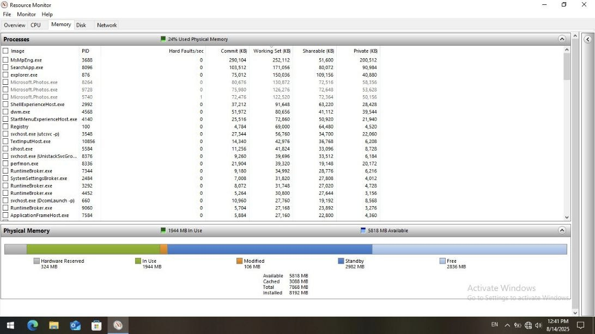
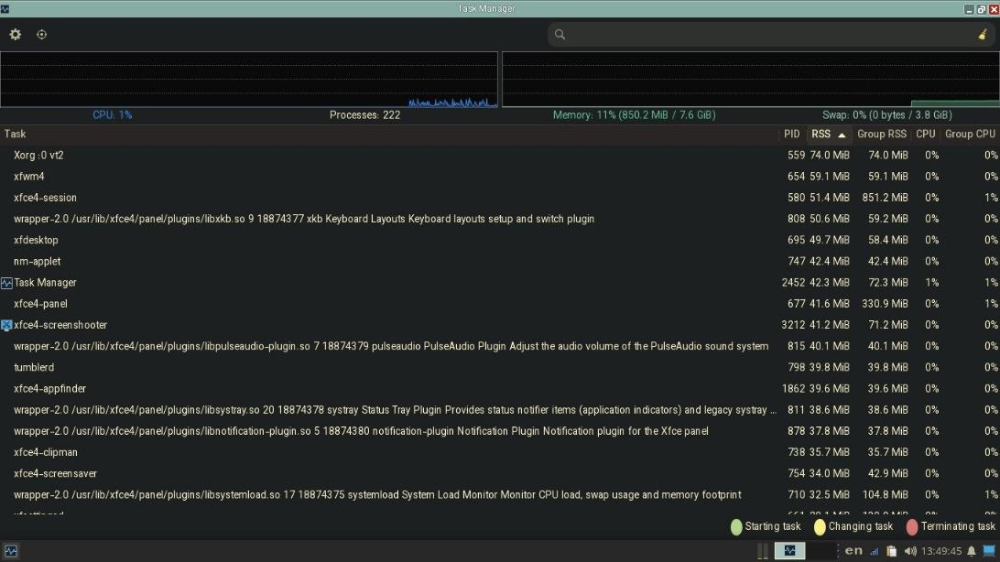
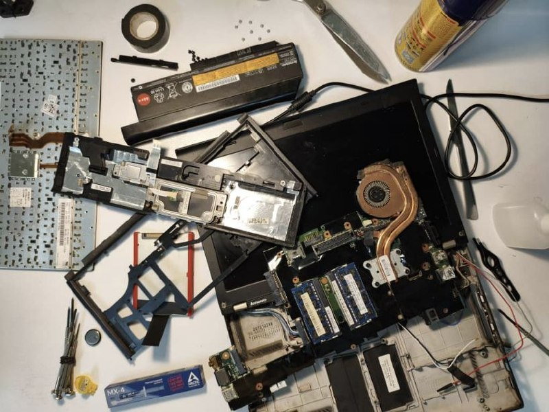
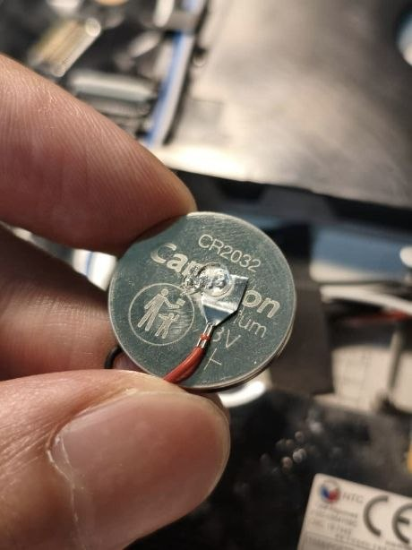
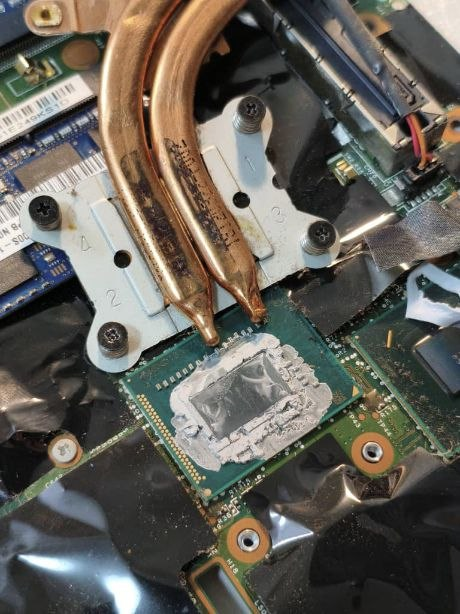
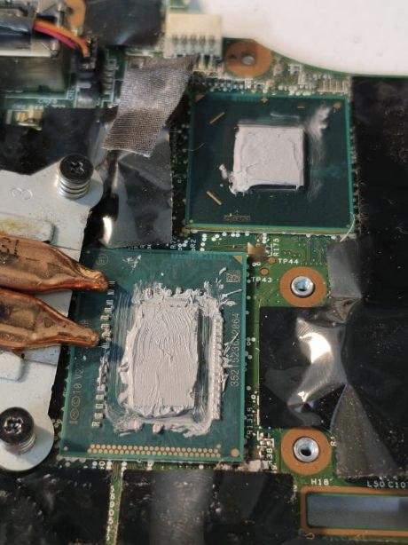
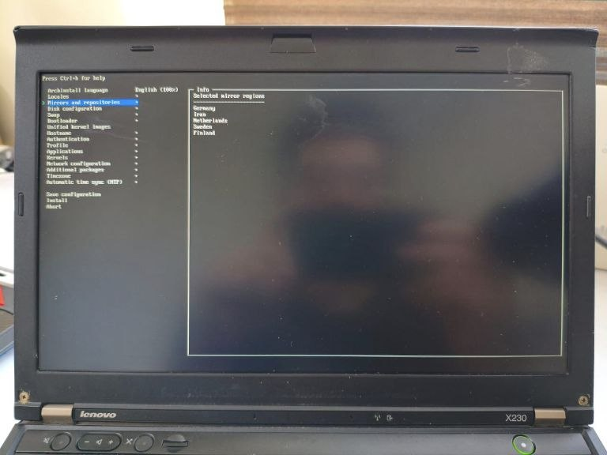

+++
title = "Setting Up Arch on an Old ThinkPad"
date = "2026-05-29T18:00:00+03:30"
lastmod = ""
#dateFormat = "2006-01-02" # This value can be configured for per-post date formatting‍
author = "yusef"
authorTwitter = "" #do not include @
cover = "cover.jpg"
tags = ["Software", "Hardware", "Linux", "Arch", "Obsidian", "Gruvbox", "Laptop", "ThinkPad"]
description = "Breathing new life into a ThinkPad X230 using Arch + XFCE"
showFullContent = false
readingTime = true
hideComments = false
draft = false
+++

Recently, I bought a used ThinkPad X230 for around $60. It came with a 3rd-gen i7 CPU, 8GB RAM, and a 180GB SSD. Decent specs for a family laptop.

The previous owner had a fresh install of Windows 10 on it, and idle RAM usage was over 2GB:



While on Arch + XFCE, it dropped to under 1GB:



Here is how.

# Hardware

Bofor installing Linux, I wanted to replace the thermal paste on the CPU and also swap the coin battery. This way, booting without the main battery (which was the upgraded 9-cell version, but completely dead anyway) would not require  manually setting the date and time every time.


Alright, you got me. I had no reason to tear the whole thing apart. I just wanted to =)

## Let the tear-down begin



I removed the old coin battery and replaced it with a new one:



Then I cleaned off the old thermal paste:



And replaced it with new paste (probably a little too much):



# Software

## Installing Arch

With the help of the [Arch Wiki](https://wiki.archlinux.org/), I went to [the official Arch Linux download page](https://archlinux.org/download/), picked a mirror close to my location, and downloaded **`archlinux-2025.08.01-x86_64.iso`** (around 900MB).

Then I plugged in a USB drive (8GB was enough) and opened [Rufus](https://rufus.ie/) to make it bootable with these settings:

- **Device**: my USB stick
- **Boot selection**: `archlinux-2025.08.01-x86_64.iso`
- **Partition scheme**: `GPT`
- **Target system**: `UEFI (non-CSM)`  

Then I clicked **START** and selected **Write in ISO Image Mode (Recommended)**

After that, I switched the BIOS mode from Legacy to UEFI because apparently it's the less painful option nowadays.

### archinstall

After booting into Arch ISO, I connected to Wi-Fi using the `iwctl` network configuration tool.

Then I typed  `archinstall` to go to the guided installer. Because I'm not a wierdo.

These were my settings:

- **Language/keyboard**: en_US (added Persian later)
- **mirror regions:**:
  - ~~Iran~~ (failed at first attempt)
  - Germany
  - Netherlands
  - Sweden
  - Finland



- **Disk**: selected the 180GB SSD
- **Disk layout**: `Erase all`
- **Bootloader**: `systemd-boot`
- **Filesystem**: `ext4`
- **Hostname**: `jfryusef`
- **Root password**: I'm not gonna tell you that
- **User account**: created one and enabled `(wheel)` (admin)
- **Network**: `NetworkManager`
- **Kernel**: `linux`
- **Microcode**: `intel-ucode`
- **Profile**: `Desktop` → `XFCE4` (light and stable)
- **Audio**: ~~`pipewire`~~ (could not get it working at first)
- **Optional packages**: `firefox` and a few others (optional)
- **Timezone**: Asia/Tehran

Then I hit **Install**.

Once the installation finished, I rebooted the system and removed the USB drive. XFCE booted correctly and I could log in immediately.

### The hard-freeze problem
Appearently, sometimes some old ThinkPads on modern Linux kernels hard-freeze because of aggressive C-states. Mine had it too.

Fix: add this kernel boot parameter: `intel_idle.max_cstate=1`

## Installing stuff

I opened a terminal and installed these packages:

- sudo pacman -S `man-db` `man-pages`  
  (built-in documentation system for commands)

- sudo pacman -S `fwupd`  
  (firmware updater)  

- sudo pacman -S `bluez` `bluez-utils`  
  (Bluetooth stack)

- sudo pacman -S `gvfs` `gvfs-mtp`  
  (virtual filesystem support + Android MTP support)

- sudo pacman -S `thunar-archive-plugin` `p7zip` `unzip` `unrar`  
  (archive utilities + Thunar integration)

- sudo pacman -S `brightnessctl`  
  (screen brightness utility)

- sudo pacman -S `pipewire` `pipewire-pulse` `wireplumber`  
  (Linux audio stack)

- sudo pacman -S `blueman`  
  (GUI Bluetooth manager)

Then I enabled the required services:

```bash
systemctl --user enable -- now pipewire pipewire-pulse wireplumber
```
```bash
sudo systemctl enable --now bluetooth
```
```bash
sudo timedatectl set-ntp true
```
I also needed an AUR helper, so I installed yay:
```bash
sudo pacman -S --needed git base-devel
```
```bash
git clone https://aur.archlinux.org/yay.git
```
```bash
cd yay
makepkg -si
```

| pacman | yay |
| - | - |
| `sudo pacman -S firefox` | `yay -S obsidian` |
| `sudo pacman -S obs-studio` | `yay -S anydesk-bin` |
| `sudo pacman -S qbittorrent` | `yay -S hiddify-app-bin` |
| --snip-- | --snip-- |

## Tweaking things

### Keyboard shortcuts

- `Alt+T`: terminal (`xfce4-terminal`)
- `Super`: application finder (`xfce4-appfinder`)
- `Super+E`: Thunar (`thunar`)
- [ThinkVantage](https://en.wikipedia.org/wiki/ThinkVantage_Technologies) button (`Launch1`): logout menu (`xfce4-session-logout`)  

I also changed the volume step size to 10% in `xfce4-pulseaudio-plugin`.


### Workspace shortcut

- `Alt+1`: workspace 1  
- `Alt+2`: workspace 2  
- `Alt+3`: workspace 3  
- `Alt+4`: workspace 4

### Winndows management

- `Alt+F`: maximize window
- `Alt+Up`: tile window to the left
- `Alt+Down`: tile window to the right
- `Alt+Page Up`: tile window to the top-left
- `Alt+Page Down`: tile window to the top-right
- `Alt+Left`: tile window to the bottom-left
- `Alt+Right`: tile window to the bottom-right  

(later regretted using Alt+Left and Alt+Right because they interfere with browser navigation shortcuts. But I kept using them anyway.)

## Ricing?

I used [Open Sans](https://github.com/googlefonts/opensans) + [JetBrains Mono](https://github.com/JetBrains/JetBrainsMono) as my main fonts, and [Gruvbox](https://github.com/morhetz/gruvbox) as the primary color palatte using [this GTK theme](https://github.com/Fausto-Korpsvart/Gruvbox-GTK-Theme).

For icons and cursors, I kept the default `elementary` theme.

These:


 are the items on my panel (a 24px bottom row):


I set `Smoothwall` as my window decoration theme. A practical choice.

Then I switched my display manager from LightDM:

```bash
sudo systemctl disable lightdm.service
```

to Ly (a TUI login manager):

```bash
sudo pacman -S ly
sudo systemctl enable ly.service
```

I also installed [this Gruvbox Firefox theme](https://addons.mozilla.org/en-US/firefox/addon/gruvboxgruvboxgruvboxgruvboxgr/) and [this VS Code theme](https://github.com/jdinhify/vscode-theme-gruvbox).

###  My Obsidian theme

Since I couldn't find any good ones for my usecases, I created [my own Obsidian Gruvbox theme](https://github.com/jfryusef/obsidian-gruvbox-aqua) that uses [Minimal theme](https://github.com/kepano/obsidian-minimal) as the base.

<!-- TODO: add obsidian-gruvbox-aqua screenshot. -->

> Once again, feel free to share similar projects.