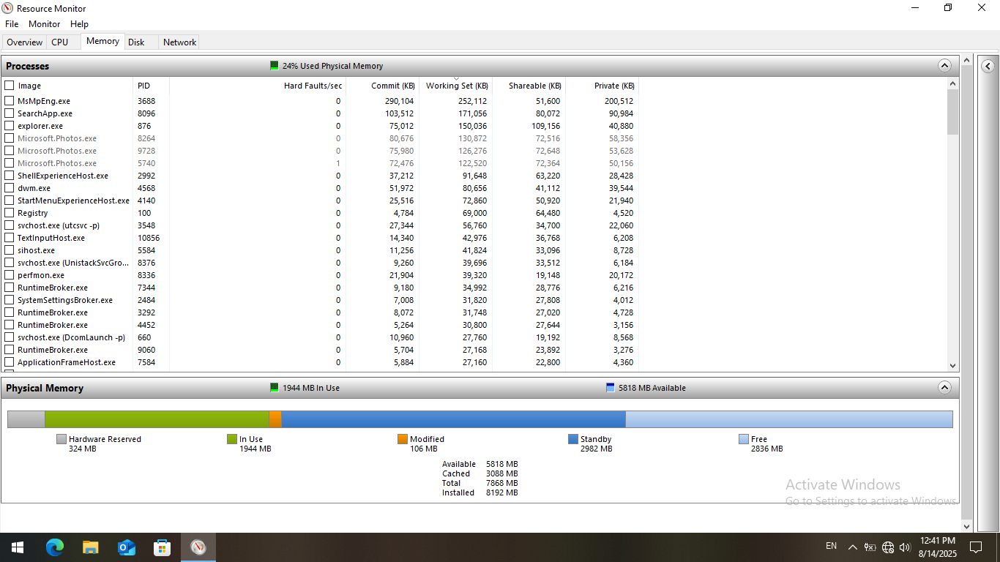
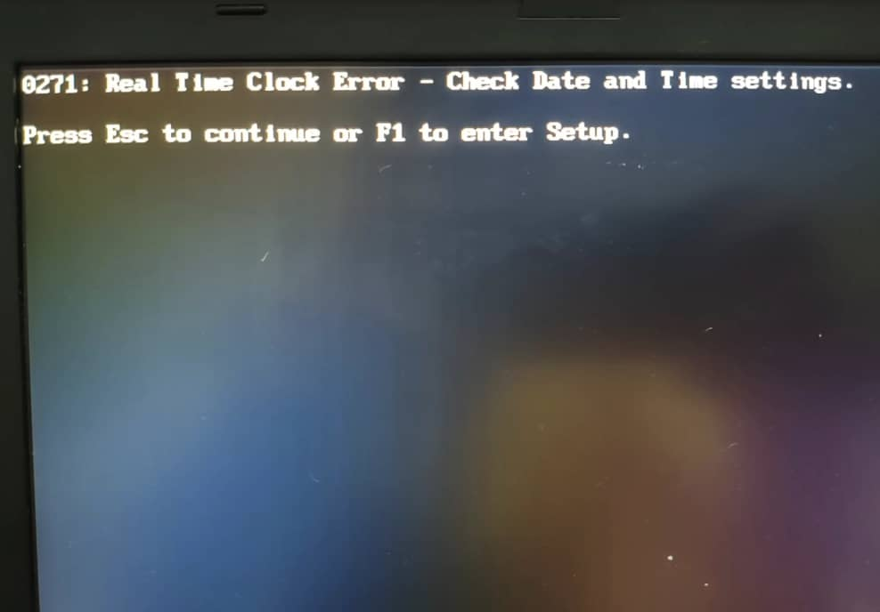
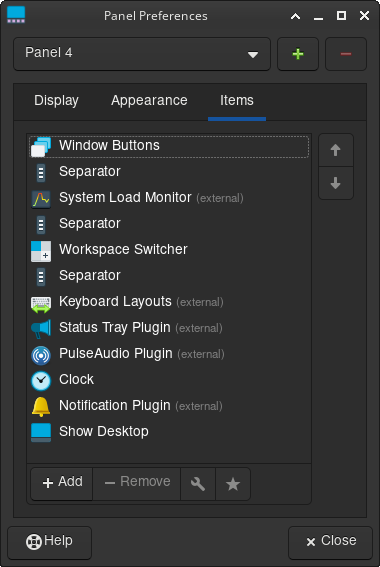

+++
title = "Setting Up Arch On An Old ThinkPad"
date = "2025-10-31T13:41:37+03:30"
lastmod = ""
#dateFormat = "2006-01-02" # This value can be configured for per-post date formatting‍
author = "yusef"
authorTwitter = "" #do not include @
cover = "../../images/x230-cover.jpg"
tags = ["ThinkPad", "Laptop", "Linux", "OS", "Arch", "Obsidian", "Hardware", "Software"]
description = "Breathing a new life to a ThinkPad X230 using Arch+XFCE"
showFullContent = false
readingTime = true
hideComments = false
draft = false
+++

Recently I bought a used ThinkPad X230 for ~$60. It had an Intel Core i7 (3rd gen) CPU, 8GB RAM (upgradable to 16GB), and 180GB SSD storage. The previous owner had a fresh install of Windows 10 on it and idle RAM usage was >%25 (2GB)

# Hardware

Bofore trying to install linux, I wanted to change the thermal paste on CPU and GPU.  
Also change the coin battery so when booting without the main battery (which was the upgraded 9-cell version but dead and useless anyway), updating date and time wouldn't need network connection or manual set-up.

Alright you got me I had no reason to tear up the whole device; I just wanted to =)

## Let the tear up begin!

 

**https://archlinux.org/download/**

- Pick any mirror **close to your location** (e.g., Europe, Asia).
- Download **`archlinux-YYYY.MM.DD-x86_64.iso`** (around 900MB).

- Plug in your USB (4GB+)
- Open (Rufus)[https://rufus.ie/]
- Settings:
  - **Device**: your USB stick
  - **Boot selection**: `archlinux-x86_64.iso`
  - **Partition scheme**: `GPT`
  - **Target system**: `UEFI (non-CSM)`
- Hit **START**, select **Write in ISO Image Mode (Recommended)** if prompted

set uefi instead of legacy in bios

iwctl
device list # find your Wi-Fi device (likely wlan0)
station wlan0 scan # scan for networks
station wlan0 get-networks # list available Wi-Fi names
station wlan0 connect YourWiFiName
exit
ping -c3 archlinux.org

archinstall

- **Language/keyboard**: en, us (added persian later in the settings)
- mirror regions (Iran failed at first attempt):
  - germany
  - netherlands
  - sweden
  - finland
- **Disk**: pick your 180 GB SSD
- **Disk layout**: “**Erase all**” for a clean install (or “Use best effort” if dual-booting, but that’s riskier)
- **Bootloader**: `systemd-boot`
- **Filesystem**: `ext4`
- **Hostname**: e.g., `x230`
- **Root password**: set it
- **User account**: add one, tick “**superuser (wheel)**”
- **Network**: `NetworkManager`
- **Kernel**: `linux` (plain)
- **Microcode**: `intel-ucode`
- **Profile**: “**Desktop**” → pick **XFCE4** (light, stable)
- **Audio**: `pipewire` (none for now)
- **Optional packages**: added `git`, `firefox`, (olptional)
- **Timezone/locale**: asia/tehran

1. Hit **Install**. When it finishes, **reboot** (remove USB).  
   You’re done. Log in, you’ll see XFCE’s login screen.

sudo pacman -S fwupd
sudo pacman -S bluez bluez-utils
sudo pacman -S gvfs gvfs-mtp
sudo pacman -S thunar-archive-plugin p7zip unzip unrar brightnessctl
sudo pacman -S pipewire pipewire-pulse wireplumber

systemctl --user enable -- now pipewire pipewire-pulse wireplumber
sudo systemctl enable --now bluetooth
sudo timedatectl set-ntp true

sudo pacman -S blueman

sudo pacman -S --needed git base-devel
git clone https://aur.archlinux.org/yay.git
cd yay
makepkg -si

| App                    | How to install on Arch                                                       |
| ---------------------- | ---------------------------------------------------------------------------- |
| **Obsidian**           | `yay -S obsidian`                                                            |
| **VS Code**            | `yay -S visual-studio-code-bin` (or `code` in repos for OSS build)           |
| **Firefox**            | `sudo pacman -S firefox`                                                     |
| **Chrome**             | `yay -S google-chrome`                                                       |
| **Calculator**         | Already in XFCE (`galculator`) or install: `sudo pacman -S gnome-calculator` |
| **Adobe Acrobat**      | Not on Linux — use `yay -S masterpdfeditor-free` or `evince`                 |
| **Hiddify**            | `yay -S hiddify-app-bin`                                                     |
| **OBS Studio**         | `sudo pacman -S obs-studio`                                                  |
| **Python 3**           | `sudo pacman -S python`                                                      |
| **qBittorrent**        | `sudo pacman -S qbittorrent`                                                 |
| **WinRAR**             | Use Linux RAR: `yay -S rar`                                                  |
| **7-Zip File Manager** | `sudo pacman -S p7zip`                                                       |
| mpv                    | sudo pacman -S mpv                                                           |
| Hugo                   | sudo pacman -S hugo                                                          |
| AnyDesk                | yay -S anydesk-bin                                                           |
Gpick color picker | yay -S gpick

wallpaper

open sans + jetbrains mono

Alt+1 : Workspace1
Alt+2 : Workspace2
Alt+3 : Workspace3
Alt+4 : Workspace4

Super L : ApplicationFinder
volume steps to 10 percent
mapped **ThinkVantage** button to logout

elementary theme for cursor

**Intel GPU driver (`i915`) hard hang**

- Common on Ivy Bridge (HD 4000).
- If GPU lockup is severe enough, it can freeze the whole kernel, not just Xorg.
- Check after reboot:
  journalctl -b -1 | grep -i "GPU HANG"
  journalctl -b -1 | grep -i i915

**Kernel bug / ACPI / power management**

- Old ThinkPads + modern Linux kernels sometimes hard-freeze because of deep C-states.
- Fix: add this kernel boot parameter in GRUB:
  intel_idle.max_cstate=1

A RAM stick health test (memtest86)

man

arch wiki

Terminal
xfce4-terminal
Alt + T (common default)
maximize windo: alt+f
tile left: alt+up  
tile right: alt+down  
tile top-left: alt+pgup  
tile top-right: alt+pgdn  
tile down-left: alt+left  
tile down-right: alt+right

https://www.xfce-look.org/p/1166289

sudo pacman -S ly
sudo systemctl disable lightdm.service
sudo systemctl enable ly.service

## ricing
 wallpaper
 icons: none
 panel
 gtk theme https://github.com/Fausto-Korpsvart/Gruvbox-GTK-Theme
 window decorations
 terminal color pallete
 firefox theme
 vs code theme
 obsidian theme (export?)
