+++
title = "Setting Up Arch On An Old ThinkPad"
date = "2025-10-31T13:41:37+03:30"
lastmod = ""
#dateFormat = "2006-01-02" # This value can be configured for per-post date formatting‍
author = "yusef"
authorTwitter = "" #do not include @
cover = "x230-cover.jpg"
tags = ["ThinkPad", "Laptop", "Linux", "OS", "Arch", "Obsidian", "Hardware", "Software"]
description = "Breathing a new life to a ThinkPad X230 using Arch+XFCE"
showFullContent = false
readingTime = true
hideComments = false
draft = true
+++

Recently I bought a used ThinkPad X230 for ~$60. It had an Intel Core i7 (3rd gen) CPU, 8 GB RAM (upgradable to 16 GB), and 180GB SSD storage. The previous owner had a fresh install of Windows 10 on it and idle RAM usage was >2 GB:
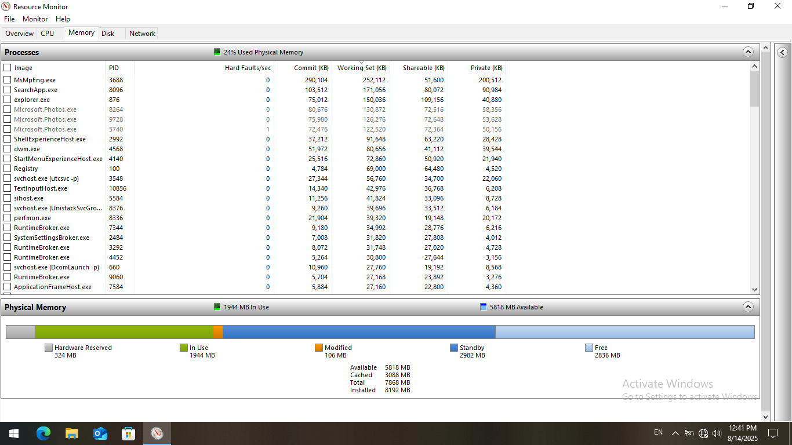
While in a fresh install of Arch + XFCE it got down to >1 GB:
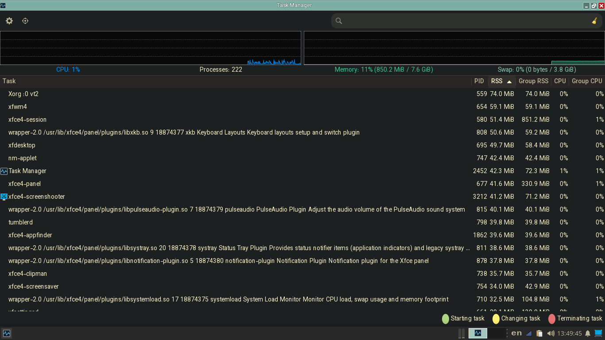

# Hardware

Bofore trying to install linux, I wanted to change the thermal paste on CPU and GPU.  
Also change the coin battery so when booting without the main battery (which was the upgraded 9-cell version but dead and useless anyway), updating date and time wouldn't need network connection or manual set-up.
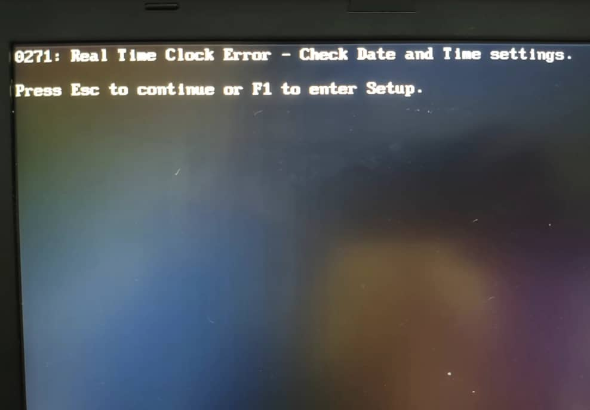
Alright you got me I had no reason to tear up the whole device; I just wanted to =)

## Let the tear up begin!

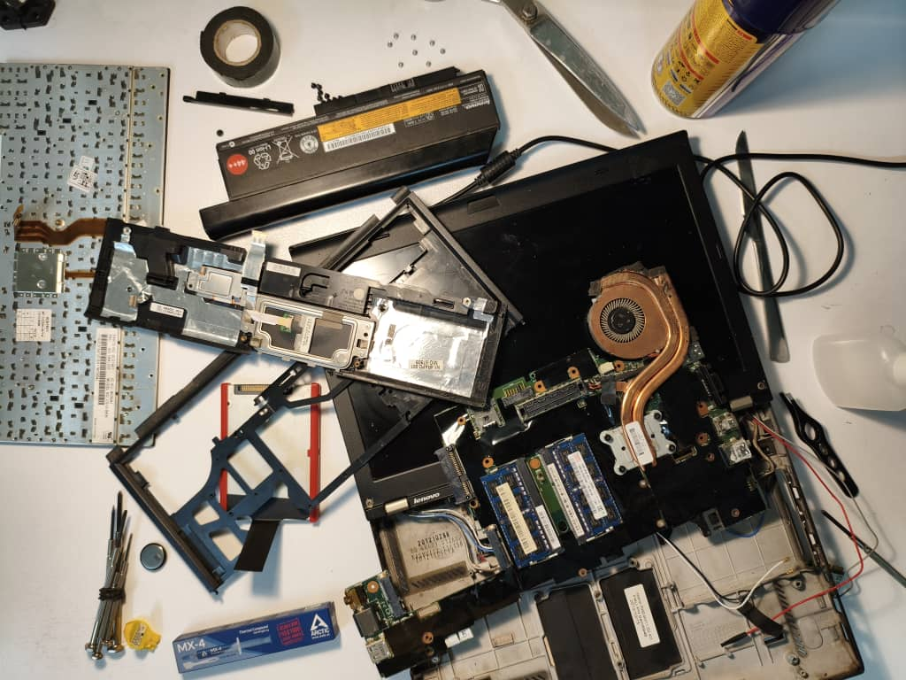

I took out the old coin battery,
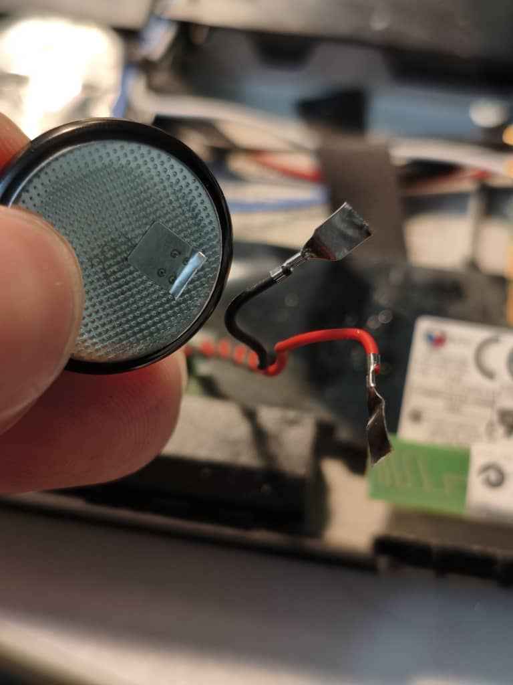

And Replaced it with the new one:
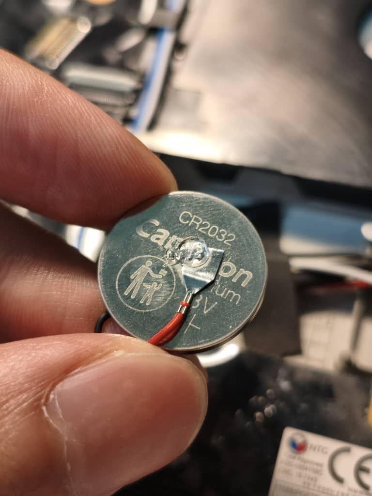

Then I cleaned the old thermal paste,
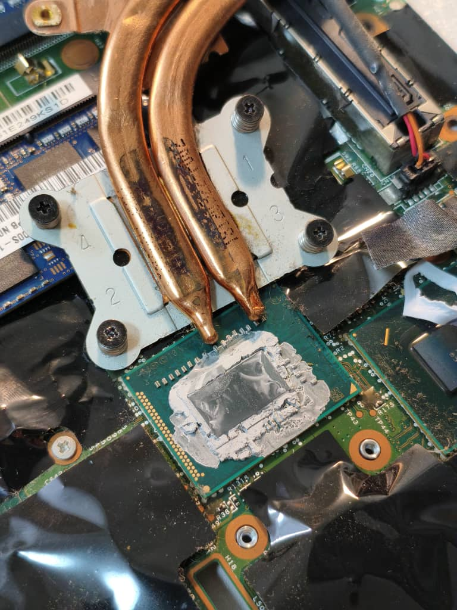
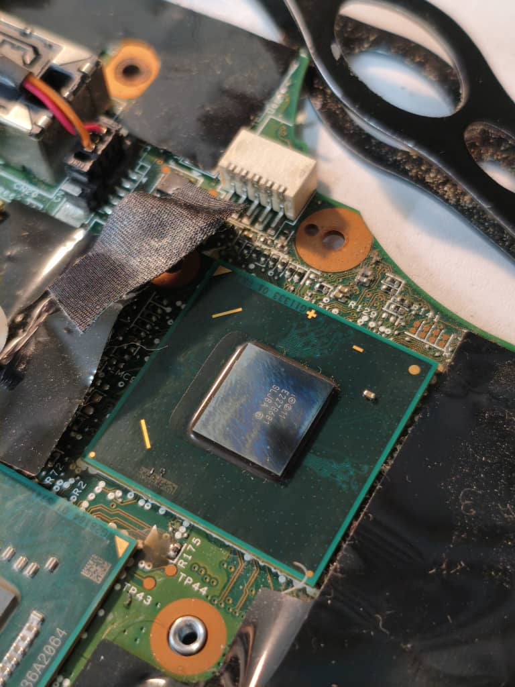

And replaced it with a new one:
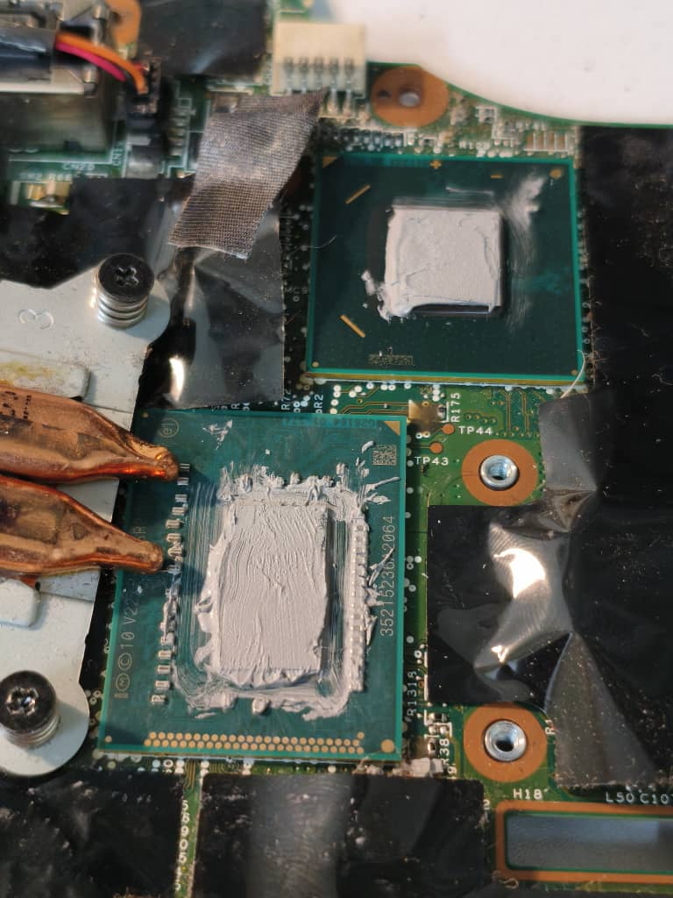

# Software

## Installing Arch

With the help of [Arch Linux Wiki](https://wiki.archlinux.org/), I went to [the official arch linux download page](https://archlinux.org/download/**), picked a mirror close to my location and downloaded **`archlinux-2025.08.01-x86_64.iso`** (around 900MB). Then I plugged in my 64 GB USB memory (only 8 was needed) and opened [Rufus](https://rufus.ie/) with these settings:
- **Device**: my USB stick
- **Boot selection**: `archlinux-2025.08.01-x86_64.iso`
- **Partition scheme**: `GPT`
- **Target system**: `UEFI (non-CSM)`  

Then I hit **START** and selected **Write in ISO Image Mode (Recommended)**

Then I setted UEFI instead of Legacy in BIOS because it's the less painful choice.

### archinstall

After booting up at archiso, I connected my device to Wi-Fi using `iwtcl` network configuration tool.
Then I typed  `archinstall` to fetch the Arch Linux database and go to guided installer. these are my settings:

- **Language/keyboard**: en, us (added persian later in the settings)
- **mirror regions** (Iran failed at first attempt):
  - Germany
  - Netherlands
  - Sweden
  - Finland
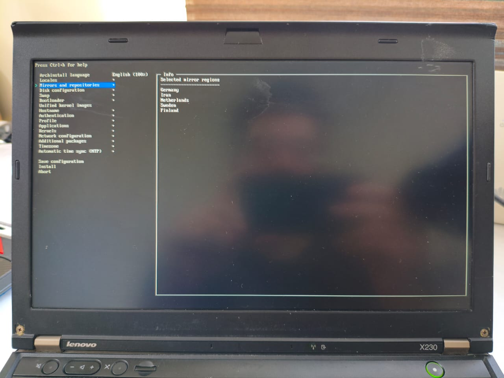
- **Disk**: picked my 180 GB SSD
- **Disk layout**: “**Erase all**” for a clean install
- **Bootloader**: `systemd-boot`
- **Filesystem**: `ext4`
- **Hostname**: e.g., `jfryusef`
- **Root password**: really?
- **User account**: add one, tick “**superuser (wheel)**”
- **Network**: `NetworkManager`
- **Kernel**: `linux` (plain)
- **Microcode**: `intel-ucode`
- **Profile**: “**Desktop**” → picked **XFCE4** (light, stable)
- **Audio**: `pipewire` (none for now)
- **Optional packages**: added `firefox` and a few more (optional)
- **Timezone**: Asia/Tehran

Then I hit **Install**. When it finished, **Reboot** (removed USB).
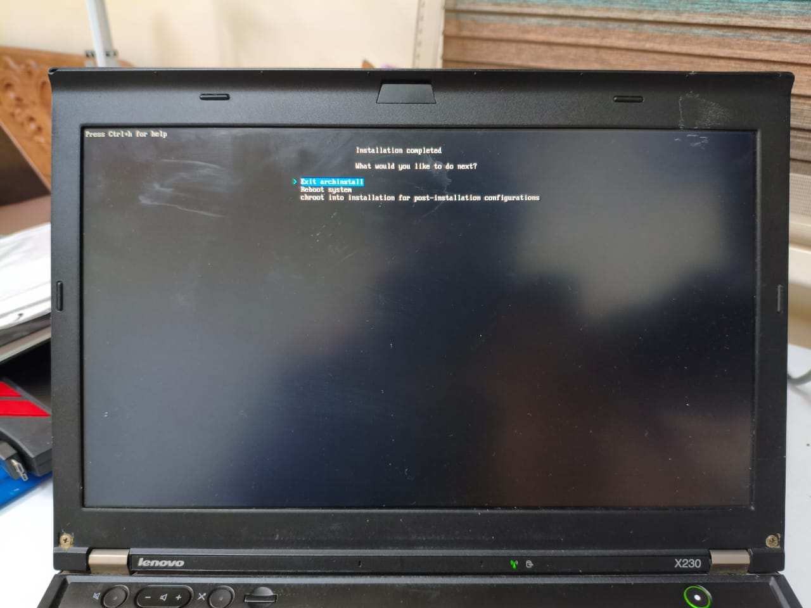
I saw XFCE’s login screen and logged in!

Old ThinkPads + modern Linux kernels sometimes hard-freeze because of deep C-states.  
Fix: added this kernel boot parameter in GRUB:
`intel_idle.max_cstate=1`

I alsp took a a RAM stick health test (memtest86) just in case.
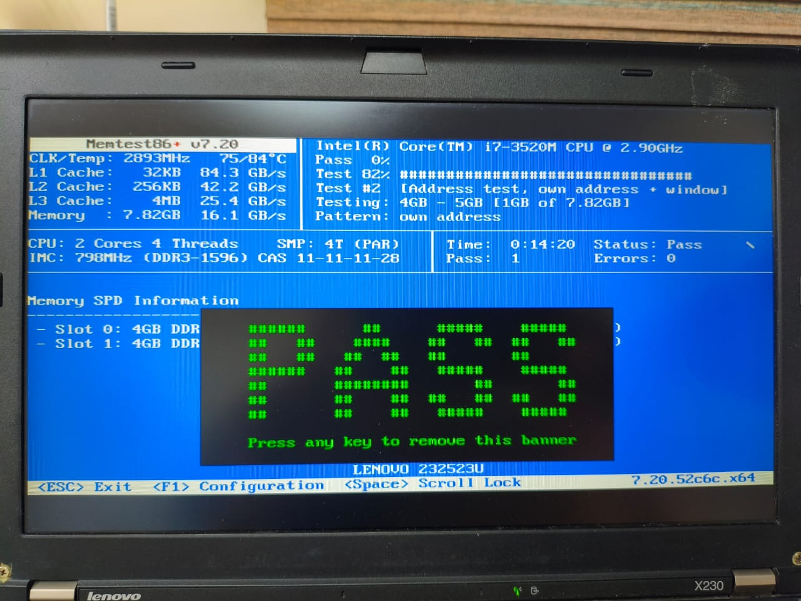

### Installing Stuff

I opened Terminal and installed these:

- sudo pacman -S `man-db` `man-pages`
  (built-in documentation system for commands)
- sudo pacman -S `fwupd`  
  (firmware updater)  
- sudo pacman -S `bluez` `bluez-utils`  
  (core Bluetooth protocol stack)
- sudo pacman -S `gvfs` `gvfs-mtp`  
  (virtual filesystem support and MTP support for Android devices)
- sudo pacman -S `thunar-archive-plugin` `p7zip` `unzip` `unrar`  
  (file manager integration tools and archive utilities)
- sudo pacman -S `brightnessctl`  
  (screen brightness control utility)
- sudo pacman -S `pipewire` `pipewire-pulse` `wireplumber`  
  (Linux audio stack)
- sudo pacman -S `blueman`  
  (GUI Bluetooth manager)

Then I typed these commands to enable the ones that needed enabling:

```bash
systemctl --user enable -- now pipewire pipewire-pulse wireplumber
```
```bash
sudo systemctl enable --now bluetooth
```
```bash
sudo timedatectl set-ntp true
```
I needed yay AUR to install some of my apps so I installed it:
```bash
sudo pacman -S --needed git base-devel
```
```bash
git clone https://aur.archlinux.org/yay.git
```
```bash
cd yay
makepkg -si
```

| pacman | yay |
| - | - |
| `sudo pacman -S firefox` | `yay -S obsidian` |
| `sudo pacman -S obs-studio` | `yay -S anydesk-bin` |
| `sudo pacman -S qbittorrent` | `yay -S hiddify-app-bin` |
| --snip-- | --snip-- |

## Tweaking things

I set some of these keyboard shortcuts:  

Alt+T: Terminal (xfce4-terminal)  
Super L: Application Finder (xfce4-appfinder)  
Super+E: ThunarFileManager (thunar)  
[ThinkVantage](https://en.wikipedia.org/wiki/ThinkVantage_Technologies) button (Launch1): Log out (xfce4-session-logout)  

Alt+1: Workspace 1  
Alt+2: Workspace 2  
Alt+3: Workspace 3  
Alt+4: Workspace 4
Alt+F: maximize window  
Alt+Up: Tile window to the left  
Alt+Down: Tile window to the right  
Alt+Page Up: Tile window to the top-left  
Alt+Page Down: Tile window to the top-right
Alt+Left: Tile window to the bottom-left  
Alt+Up: Tile window to the bottom-right  

also I changed Volume steps to 10% in Volume Control (xfce4-pulseaudio-plugin)

## ricing

I tried to use [Open Sans](https://github.com/googlefonts/opensans) + [JetBrains Mono](https://github.com/JetBrains/JetBrainsMono) as my main fonts and [Gruvbox](https://github.com/morhetz/gruvbox) as my main color palatte using [this theme](https://github.com/Fausto-Korpsvart/Gruvbox-GTK-Theme) throughout the whole UI.

I switched my diplay manager from LighDM,
```bash
sudo systemctl disable lightdm.service
```
to Ly (a lightweight login manager that runs in the terminal):
```bash
sudo pacman -S ly
sudo systemctl enable ly.service
```

Then I set this gruvbox themed picture as my wallpaper:
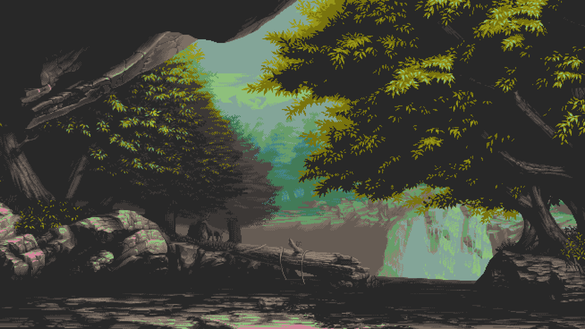

These are the items on my panel (a 24px buttom row):
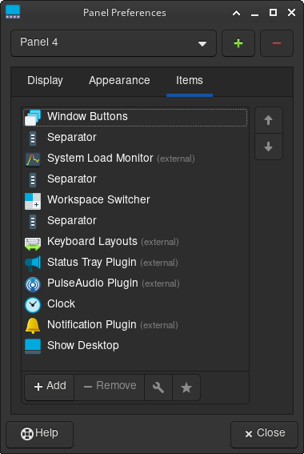

I set `Smoothwall` as my window decorations

I downloaded [this ?????  Firefox theme](addons.mozilla.org/en-US/firefox/addon/gruvboxgruvboxgruvboxgruvboxgr) and [Th?is VS Co?de theme?](jdinh?life.gr?uvbox)
and created this Obsidian theme (put on github?????):
```json
{
  "minimal-style@@ax1@@dark": "#83A598",
  "minimal-style@@callouts-style": "callouts-default",
  "minimal-style@@h1-l": false,
  "minimal-style@@h1-size": "2em",
  "minimal-style@@h1-weight": 900,
  "minimal-style@@h2-weight": 800,
  "minimal-style@@h2-size": "1.8em",
  "minimal-style@@h2-l": false,
  "minimal-style@@h3-l": false,
  "minimal-style@@h3-size": "1.6em",
  "minimal-style@@h6-weight": 400,
  "minimal-style@@h5-weight": 500,
  "minimal-style@@h1-variant": "small-caps",
  "minimal-style@@h6-variant": "small-caps",
  "minimal-style@@h5-variant": "small-caps",
  "minimal-style@@h4-variant": "small-caps",
  "minimal-style@@h2-variant": "small-caps",
  "minimal-style@@h3-weight": 700,
  "minimal-style@@h4-weight": 600,
  "minimal-style@@h6-size": "1em",
  "minimal-style@@h4-size": "1.4em",
  "minimal-style@@h5-size": "1.2em",
  "minimal-style@@icon-muted": 0.5,
  "minimal-style@@active-line-on": false,
  "minimal-style@@checkbox-shape": "checkbox-square",
  "minimal-style@@metadata-heading-off": false,
  "minimal-style@@metadata-add-property-off": true,
  "minimal-style@@metadata-dividers": false,
  "minimal-style@@metadata-icons-off": false,
  "minimal-style@@sidebar-tabs-style": "sidebar-tabs-underline",
  "minimal-style@@sidebar-tabs-names": "tab-names-off",
  "minimal-style@@vault-profile-display": "vault-profile-default",
  "minimal-style@@hide-help": true,
  "minimal-style@@ribbon-style": "ribbon-hidden",
  "minimal-style@@tabs-style": "tabs-underline",
  "minimal-style@@tag-radius": "4px",
  "minimal-style@@hl2@@dark": "#665C54",
  "minimal-style@@window-title-off": false,
  "minimal-style@@titlebar-text-weight": 100,
  "minimal-advanced@@hide-settings-desc": false,
  "minimal-advanced@@cursor": "default",
  "minimal-style@@inline-title-size": "2em",
  "minimal-style@@inline-title-weight": 900,
  "minimal-style@@inline-title-color@@dark": "#689D6A",
  "minimal-style@@color-red@@dark": "#CC241D",
  "minimal-style@@color-orange@@dark": "#D65D0E",
  "minimal-style@@color-yellow@@dark": "#D79921",
  "minimal-style@@color-green@@dark": "#98971A",
  "minimal-style@@color-blue@@dark": "#458588",
  "minimal-style@@color-purple@@dark": "#B16286",
  "minimal-style@@color-cyan@@dark": "#689D6A",
  "minimal-style@@color-pink@@dark": "#D3869B",
  "minimal-style@@ax2@@dark": "#458588",
  "minimal-style@@blockquote-border-thickness": 3,
  "minimal-style@@blockquote-border-color@@dark": "#D5C4A1",
  "minimal-style@@blockquote-font-style": "normal",
  "minimal-style@@blockquote-color@@dark": "#D5C4A1",
  "minimal-style@@graph-node@@dark": "#D65D0E",
  "minimal-style@@graph-line@@dark": "#D79921",
  "minimal-style@@icon-color-hover@@dark": "#D5C4A1",
  "minimal-style@@icon-color-active@@dark": "#EBDBB2",
  "minimal-style@@icon-color-focused@@dark": "#FBF1C7",
  "minimal-style@@indentation-guide-color-active@@dark": "#504945",
  "minimal-style@@indentation-guide-color@@dark": "#32302F",
  "minimal-style@@minimal-tab-text-color@@dark": "#BDAE93",
  "minimal-style@@minimal-tab-text-color-active@@dark": "#FBF1C7",
  "minimal-style@@tag-background-hover@@dark": "#282828",
  "minimal-style@@tx1@@dark": "#EBDBB2",
  "minimal-style@@text-formatting@@dark": "#D5C4A1",
  "minimal-style@@tag-color@@dark": "#D5C4A1",
  "minimal-style@@sp1@@dark": "#1D2021",
  "minimal-style@@graph-node-attachment@@dark": "#B16286",
  "minimal-style@@base@@dark": "#282828",
  "minimal-style@@bg1@@dark": "#1D2021",
  "minimal-style@@ui3@@dark": "#665C54",
  "minimal-style@@ui1@@dark": "#3C3836",
  "minimal-style@@ui2@@dark": "#504945",
  "minimal-style@@ax3@@dark": "#689D6A",
  "minimal-style@@canvas-dot-pattern@@dark": "#3C3836",
  "minimal-style@@code-normal@@dark": "#EBDBB2",
  "minimal-style@@code-background@@dark": "#282828",
  "minimal-style@@code-comment@@dark": "#928374",
  "minimal-style@@code-operator@@dark": "#D65D0E",
  "minimal-style@@code-punctuation@@dark": "#458588",
  "minimal-style@@graph-node-focused@@dark": "#8EC07C",
  "minimal-style@@graph-node-tag@@dark": "#458588",
  "minimal-style@@graph-node-unresolved@@dark": "#928374",
  "minimal-style@@h3-variant": "small-caps",
  "minimal-style@@icon-color@@dark": "#BDAE93",
  "minimal-style@@image-muted": 0.7,
  "minimal-style@@hl1@@dark": "#3C3836",
  "minimal-style@@tx2@@dark": "#A89984",
  "minimal-style@@tx3@@dark": "#665C54"
}
```

but I use the default "elementary" theme for my cursor and icons.
